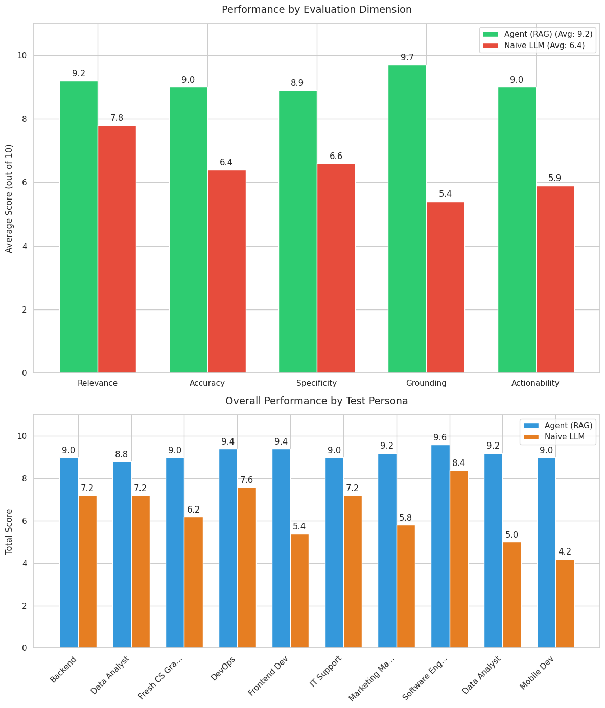
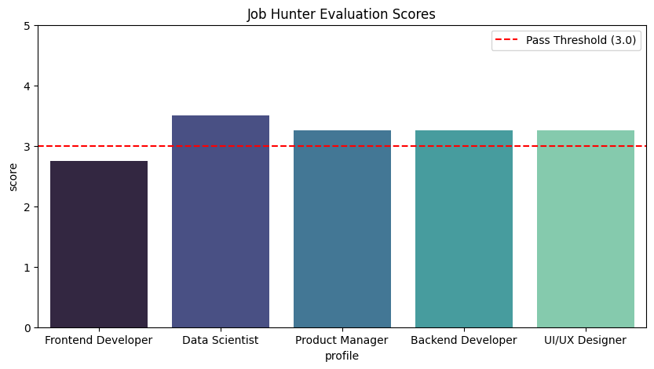

# CareerAtlas

**Note: The working repository is currently private due to workshop rules.**

## About The Project

CareerAtlas is an AI-powered platform designed to supercharge your career journey. It acts as an intelligent career companion, analyzing your resume, identifying skills gaps, researching the market, and matching you with relevant job opportunities.

Through its multi-agent architecture, CareerAtlas provides tailored roadmaps and actionable insights to help you achieve your career goals.

## Features

- **Intelligent Resume Extraction:** Automatically parses resumes to extract key skills, work experience, and personal projects.
- **Skill Gap Analysis:** Compares your current skill set against target job roles to identify missing technical and soft skills.
- **Personalized Career Roadmaps:** Generates structured learning paths to help you bridge your skill gaps and reach your career objectives.
- **Market-Driven Job Finder:** Recommends relevant job openings tailored to your profile and location.
- **Deep Research Insights:** Conducts in-depth research on industries, companies, and roles to provide actionable career intelligence.
- **Interactive Dashboard:** A seamless, user-friendly interface to track your progress, view job matches, and explore learning roadmaps.

## Methodology

CareerAtlas is built upon a **Multi-Agent Architecture** where specialized AI agents handle specific aspects of the career planning process:

1. **Extraction & Matching Agents:** Dedicated agents analyze resume data and query job markets to find the best possible matches.
2. **Gap Analysis & Research Agents:** Deep researcher agents investigate market trends, while gap analysis agents compare user profiles against industry standards.
3. **Evaluation Framework:** Extensive evaluation notebooks were developed to iteratively test, benchmark, and improve agent accuracy and reliability.
4. **Web Deployment:** The agents are orchestrated and deployed behind a visually engaging web interface, providing real-time career guidance.

## Walkthrough

Here is a visual walkthrough of the platform:

### 1. Landing Page

### 2. User Dashboard

### 3. Resume Extraction - Skills

### 4. Resume Extraction - Experience

### 5. Resume Extraction - Projects

### 6. Career Roadmap

### 7. Skill Gap Analysis

### 8. Job Finder

## Evaluation & Benchmarks

To ensure the reliability and accuracy of CareerAtlas, we developed an extensive evaluation framework using **LLM-as-a-Judge** methodologies and field-level metrics. Our evaluation process rigorous tests the core agents:

### 1. Gap Analysis Agent
We conducted a head-to-head comparison between our RAG-augmented agent (Pinecone + BM25 + Jina Reranker) and a Naive LLM across 10 realistic career transition personas. An independent LLM judge (Google Gemini) scored both approaches, proving that our agent significantly outperforms the baseline in relevance, accuracy, and actionability by grounding recommendations in real job-market taxonomy.

### 2. Resume Extraction Agent
We systematically tested the extraction pipeline using ground-truth test cases, measuring field-level metrics (Precision, Recall, F1 for lists; Accuracy for strings). Real PDF resumes were also scored out of 10 by an LLM-as-Judge to guarantee high fidelity in parsing skills and experiences.

### 3. Deep Researcher Agent
This LangGraph-based agent (which plans, searches via Tavily, and structures learning pathways) was evaluated on diverse profiles. An OpenRouter judge validated the quality of the generated roadmaps, scoring the pathways based on resource relevance and curriculum structure.

### 4. Job Hunter Agent
Using Adzuna for search and Jina for embeddings, the job hunter was evaluated on mock profiles to ensure high role relevance, location compliance, and skill alignment.

## Contributors

- **Tanush Tambe** - Resume Extractor and Job Finder, Evaluation Notebooks
- **Dripto Bhattacharyya** - Deep Researcher and Deployment
- **Sidhaarth Shree** - Gap Analysis Agent
- **G Hamsini** - Contributor
- **Shivanshu Gupta** - Contributor
